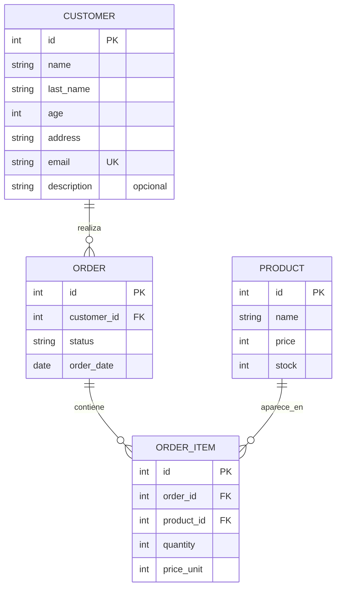

# NuvStock — Sistema de Gestión de Pedidos e Inventario

API REST desarrollada con Python y FastAPI para administrar clientes, productos, inventario y pedidos. Al registrar un pedido, comprueba y descuenta las existencias disponibles, conserva el precio aplicado a cada artículo y calcula el total a partir de sus líneas.

El proyecto está pensado como una API backend de portfolio: además de operaciones CRUD, implementa reglas de negocio para stock, cancelaciones y transiciones de estado, con una suite de pruebas aislada de la base de datos local.

> Este proyecto fue desarrollado por el autor con fines de aprendizaje y portfolio. Se utilizó IA para consultas puntuales (dudas de conceptos, revisión de código y detección de errores), para generar el script de seed y para redactar este README. El diseño, la implementación del resto del proyecto y las decisiones técnicas son propias.

## Tecnologías


- **Python 3.13 o superior** para el entorno de ejecución.
- **FastAPI** para las rutas REST y la documentación OpenAPI.
- **SQLModel** para modelos, validación y persistencia con SQLAlchemy y Pydantic.
- **SQLite** como base de datos para la ejecución local y **PostgreSQL** al usar Docker Compose.
- **Docker Compose** para ejecutar la API y PostgreSQL en contenedores.
- **pytest** y **httpx2** para las pruebas.
- **uv** para administrar el entorno y las dependencias.
- **python-dotenv** para cargar variables desde `.env`.

## Modelo de datos



`OrderItem` es la entidad asociativa entre `Order` y `Product`: conserva la cantidad y el precio unitario aplicado cuando se creó el pedido. En la implementación actual, `price` y `price_unit` son enteros; no se declara una moneda en el modelo.

## Instalación y ejecución local

Cloná el repositorio y entrá en su directorio:

	 ```bash
	 git clone https://github.com/diegosei/Nuvstock.git
	 cd Nuvstock
	 ```

Desde la raíz del proyecto:

1. Creá el archivo de entorno a partir de la plantilla incluida.

	 ```bash
	 cp .env.example .env
	 ```

	 La plantilla configura SQLite en `db.sqlite3`:

	 ```dotenv
	 DATABASE_URL=sqlite:///db.sqlite3
	 ```

	 `app/database.py` carga `.env` con `python-dotenv`; al iniciar la aplicación se crean las tablas del modelo.

2. Sincronizá las dependencias y creá el entorno virtual.

	 ```bash
	 uv sync --dev
	 ```

3. Iniciá el servidor de desarrollo.

	 ```bash
	 uv run fastapi dev app/main.py
	 ```

	 La API queda disponible en `http://127.0.0.1:8000`. La documentación interactiva de Swagger UI está en `/docs` y ReDoc en `/redoc`.

## Ejecución con Docker

Se requiere Docker Desktop o Docker Engine con el plugin de Docker Compose. Desde la raíz del proyecto, construí la imagen e iniciá la API junto con PostgreSQL:

```bash
docker compose up --build
```

Compose espera a que PostgreSQL esté saludable antes de iniciar la API. Al arrancar, la aplicación crea las tablas del modelo. La API queda disponible en `http://localhost:8000`; Swagger UI está en `/docs` y ReDoc en `/redoc`.

Para dejar los servicios en segundo plano:

```bash
docker compose up --build -d
```

Podés consultar su estado y los logs con `docker compose ps` y `docker compose logs -f`. Para detenerlos sin borrar la base de datos, ejecutá:

```bash
docker compose down
```

PostgreSQL guarda sus datos en el volumen `postgres_data`, que persiste entre reinicios y recreaciones de los contenedores. `docker compose down -v` también elimina ese volumen y todos los datos guardados.

Compose usa por defecto `nuvstock` como usuario y base de datos, y `nuvstock_dev` como contraseña. Son valores para desarrollo local; podés cambiarlos definiendo `POSTGRES_USER`, `POSTGRES_PASSWORD` y `POSTGRES_DB` en el entorno o en un archivo `.env`.

Para cargar datos de ejemplo desde el contenedor, ejecutá `docker compose exec api python -m scripts.seed`. El seed borra y recrea las tablas de PostgreSQL, por lo que elimina los datos existentes.

## Probar la API

Importá `postman_collection.json` en Postman para usar las solicitudes preconfiguradas. La colección ya define `baseUrl` como `http://127.0.0.1:8000`.

Para cargar datos de ejemplo, ejecutá desde la raíz del proyecto. El seed borra y recrea las tablas de la base configurada, así que elimina los datos que ya tenga:

```bash
uv run python -m scripts.seed
```

## Pruebas

Ejecutá toda la suite desde la raíz del repositorio:

```bash
uv run pytest -v
```

Las pruebas usan una base SQLite en memoria (`StaticPool`) y sustituyen `get_session` mediante `app.dependency_overrides`, por lo que no modifican `db.sqlite3`. Cubren CRUD, validaciones, errores, descuento y restauración de stock, atomicidad al crear pedidos y transiciones de estado válidas e inválidas.

## API

Todas las rutas están disponibles bajo la raíz del servidor, sin prefijo adicional. FastAPI publica el esquema OpenAPI en `/openapi.json`.

Además, `GET /` devuelve `{"message":"ok"}` y `GET /health` ofrece una comprobación básica del servicio.

### Customers

| Método | Ruta | Descripción | Respuesta habitual |
| --- | --- | --- | --- |
| `POST` | `/customers` | Crear cliente | `201 Created` |
| `GET` | `/customers` | Listar clientes | `200 OK` |
| `GET` | `/customers/{customer_id}` | Obtener cliente | `200 OK`, `404` si no existe |
| `PATCH` | `/customers/{customer_id}` | Actualizar campos enviados | `200 OK`, `404` si no existe |
| `DELETE` | `/customers/{customer_id}` | Eliminar cliente | `204 No Content`, `404` si no existe |

Ejemplo de creación:

```http
POST /customers
Content-Type: application/json
```

```json
{
	"name": "Ada",
	"last_name": "Lovelace",
	"age": 36,
	"address": "12 St James's Square",
	"email": "ada@example.com"
}
```

Respuesta `201 Created` (el identificador se genera en la base de datos):

```json
{
	"name": "Ada",
	"last_name": "Lovelace",
	"age": 36,
	"address": "12 St James's Square",
	"description": null,
	"email": "ada@example.com",
	"id": 1
}
```

El correo debe ser válido y único. Un correo duplicado produce `400 Bad Request`; un cuerpo que no supera la validación de entrada produce `422 Unprocessable Entity`.

### Products

| Método | Ruta | Descripción | Respuesta habitual |
| --- | --- | --- | --- |
| `POST` | `/products` | Crear producto | `201 Created` |
| `GET` | `/products` | Listar productos | `200 OK` |
| `GET` | `/products/{product_id}` | Obtener producto | `200 OK`, `404` si no existe |
| `PATCH` | `/products/{product_id}` | Actualizar campos enviados | `200 OK`, `404` si no existe |
| `DELETE` | `/products/{product_id}` | Eliminar producto | `204 No Content`, `404` si no existe |

`price` y `stock` son valores enteros no negativos. Para crear un producto, enviá por ejemplo `{"name":"Teclado","price":45000,"stock":5}`.

### Orders

| Método | Ruta | Descripción | Respuesta habitual |
| --- | --- | --- | --- |
| `POST` | `/orders` | Crear pedido y sus artículos | `201 Created`; `400` si no alcanza el stock; `404` si falta el cliente o algún producto |
| `GET` | `/orders` | Listar pedidos con total calculado | `200 OK` |
| `GET` | `/orders/{order_id}` | Obtener pedido con total calculado | `200 OK`, `404` si no existe |
| `PATCH` | `/orders/{order_id}` | Cambiar estado | `200 OK`, `400` si la transición no está permitida, `404` si no existe |

No existe `DELETE` para pedidos. El servidor asigna el estado inicial `pending` y la fecha del día; cada `price_unit` se toma del precio vigente en el servidor. Antes de probar este flujo, creá un cliente y un producto, y reemplazá sus identificadores por los devueltos por la API.

Crear un pedido:

```http
POST /orders
Content-Type: application/json
```

```json
{
	"customer_id": 1,
	"items": [
		{ "product_id": 1, "quantity": 2 }
	]
}
```

Respuesta `201 Created` de ejemplo (suponiendo un precio de producto de `45000`):

```json
{
	"status": "pending",
	"order_date": "2026-09-29",
	"id": 1,
	"customer_id": 1,
	"items": [
		{
			"product_id": 1,
			"quantity": 2,
			"price_unit": 45000,
			"id": 1,
			"order_id": 1
		}
	],
	"total": 90000.0
}
```

Si el stock disponible es insuficiente, la respuesta es `400 Bad Request` y no se crea el pedido ni se descuenta stock:

```json
{
	"detail": "not enough stock for product 1"
}
```

Cambiar el estado, por ejemplo de `pending` a `paid`:

```http
PATCH /orders/1
Content-Type: application/json
```

```json
{
	"status": "paid"
}
```

Respuesta `200 OK`:

```json
{
	"status": "paid",
	"order_date": "2026-09-29",
	"id": 1,
	"customer_id": 1
}
```

## Decisiones técnicas

- **Validación de stock antes de escribir:** la cantidad solicitada se agrega por producto, incluso si un mismo `product_id` aparece en varias líneas. Se comprueba todo el pedido antes de modificar existencias o persistirlo; si algún producto no tiene stock suficiente, se rechaza la operación completa.
- **Precio autoritativo del servidor:** el cliente solo envía `product_id` y `quantity`. El servidor fija `price_unit` con el precio actual del producto al momento de crear el pedido, de modo que no se puede manipular el total enviando un precio arbitrario.
- **Total reproducible:** se calcula como la suma de `quantity * price_unit` de las líneas guardadas. Así, cambios posteriores en el precio de un producto no alteran el importe histórico del pedido.
- **Estados explícitos:** la API permite `pending → paid`, `pending → cancelled`, `paid → shipped` y `paid → cancelled`. `shipped` y `cancelled` son estados finales. Cancelar un pedido pendiente o pagado restaura las cantidades reservadas; los pedidos se conservan para mantener trazabilidad y por eso no tienen endpoint de borrado.
- **Integridad de clientes:** `email` se declara único y los conflictos de `IntegrityError` al crear o actualizar clientes se convierten en `400 Bad Request`.
- **Validación de productos:** `price` y `stock` tienen restricciones `Field(ge=0)` en los modelos de creación y actualización.
- **Aislamiento de tests:** los fixtures crean una base temporal en memoria e inyectan la sesión de prueba, evitando tocar la base de desarrollo.

## Estructura del proyecto

```text
.
├── app/
│   ├── main.py
│   ├── database.py
│   ├── models/
│   │   ├── customers.py
│   │   ├── orders.py
│   │   └── products.py
│   ├── routers/
│   │   ├── customers.py
│   │   ├── orders.py
│   │   └── products.py
│   └── tests/
│       ├── conftest.py
│       ├── test_customers.py
│       ├── test_orders.py
│       └── test_products.py
├── postman_collection.json
├── scripts/
│   └── seed.py
├── src/
│   └── project_nuvstock/
│       └── __init__.py
├── .env.example
├── pyproject.toml
└── uv.lock
```

## Mejoras futuras

- **Autenticación y autorización:** incorporar JWT, usuarios y permisos por operación.
- **Paginación y filtros:** añadir parámetros para consultar clientes, productos y pedidos de forma eficiente.
- **Migraciones de esquema:** integrar Alembic en lugar de depender únicamente de la creación automática de tablas al iniciar.
- **Despliegue:** configurar una base de datos adecuada para producción, variables y secretos del entorno, contenedor y pipeline de CI/CD.
- **Concurrencia de inventario:** reforzar las reservas de stock con transacciones y controles de concurrencia pensados para múltiples solicitudes simultáneas.
